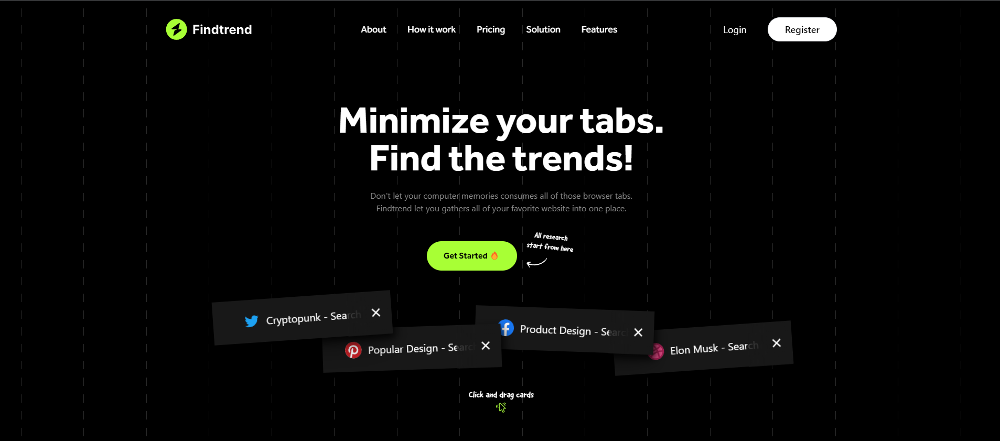

<h1 id="sobre" style="margin-top: 20px; margin-bottom: 20px; text-align: center;"><strong>FindTrend</strong></h1>

> Não deixe que as memórias do seu computador consumam todas as abas do navegador. Findtrend permite reunir todos os seus sites favoritos em um só lugar.





## Como instalar

* Para baixar o projeto, siga as instruções abaixo:

```
1. git clone https://github.com/erosMariano/findtrend.git
2. cd findtrend
```

* Instale as dependências e inicie o servidor:

```
3. yarn install
4. yarn dev
```

ou

```
3. npm install
4. npm dev
```


## Entre em contato
[Eros Mariano - Linkedin](https://www.linkedin.com/in/erosmariano)


Feito com ❤️ por Eros Mariano 👋🏽 Entre em contato!
